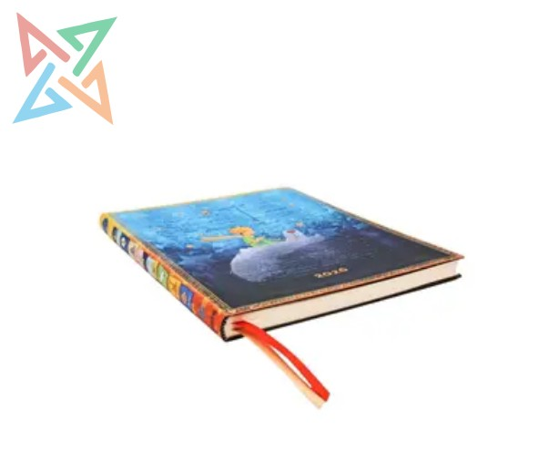

# Juego de Poemas – Concurso de creatividad

Es un juego de consola en Python donde varios jugadores pueden escribir poemas por turnos. 
Al final, los poemas se muestran y se elige cuál es el mejor. 
Está diseñado para ser muy sencillo, usando solo funciones básicas, listas y entradas por teclado.

## Enlace del proyecto
[Ver proyecto en GitHub](https://github.com/PaulaMilen/juego-poemas)
